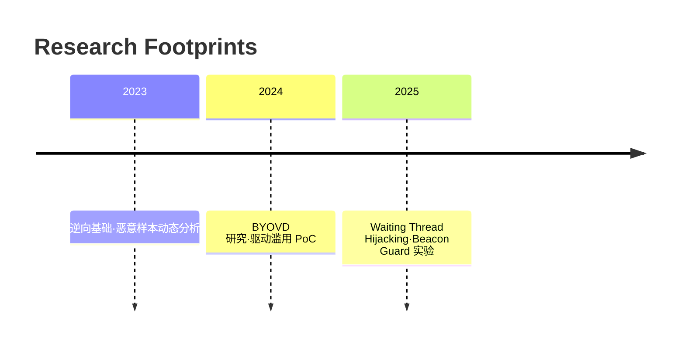

<h1 align="center">嘿，我是 Changmen</h1>

Security Researcher · Reverse Engineer · Windows Offensive R&D

  
  
  

---

## ✨ 状态面板

  
  

  

---

## 🚀 Featured Research

| Project | 技术标签 | 描述 |
| --- | --- | --- |
| [WaitingThreadInject](https://github.com/250wuyifan/WaitingThreadInject) | `Thread Hijacking` `ZwWriteVirtualMemory` | 使用等待线程劫持，通过栈返回地址重定向实现低噪声注入，并自动管理内存权限。 |
| [BYOVD-终止进程](https://github.com/250wuyifan/byovd-终止进程) | `BYOVD` `IOCTL` `Kernel Driver` | 利用合法漏洞驱动的 DeviceIoControl 接口绕过保护终止指定进程。 |
| [BeaconGuard (WIP)](https://github.com/250wuyifan/BeaconGuard) | `Detours` `Anti-Shellcode` | Hook VirtualAlloc/Sleep 捕获恶意 shellcode 并通过异常向量恢复执行上下文。 |

> ✅ 想了解更多研究？查看 [Projects.md](./PROJECTS.md) 获取路线图和实验记录。

---

## 🛠️ Stack & Interests

- **逆向 & 漏洞**：IDA / Ghidra / WinDbg / x64dbg
- **系统编程**：C / C++ · Windows API · NT 内核
- **武器化研究**：Process Injection、BYOVD、Inline Hook、ETW Bypass
- **自动化**：Python tooling、Rust PoC、IDA Python
- **最近在做**：
  - ✅ Waiting Thread Hijacking 注入链优化
  - 🔄 驱动层进程终止防御对抗
  - 🧪 Beacon 内存属性动态切换与异常恢复

---

## 📌 Timeline

---

## 🔗 Connect

- Blog：<https://blog.changmen.io>
- Twitter：[@changmensec](https://twitter.com/changmensec)
- Telegram：[@changmenlabs](https://t.me/changmenlabs)
- Email：`changmen@protonmail.com`

> *Stay curious · Stay offensive · Stay sharp.*
