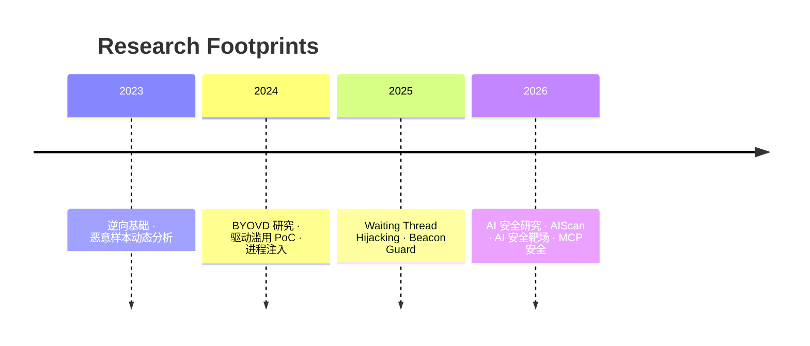

<div align="center">


<br/>

<samp>Windows Offensive R&D · AI Security · Process Injection · Kernel Exploitation</samp>

<br/><br/>

[](https://github.com/250wuyifan)
[](mailto:changmen@protonmail.com)
[](https://twitter.com/changmensec)
[](https://t.me/changmenlabs)
[](https://blog.changmen.io)

</div>

<br/>

## `$ whoami`

```text
┌──────────────────────────────────────────────────────────────┐
│                                                              │
│   Changmen / 250wuyifan                                      │
│                                                              │
│   > Security Researcher & Reverse Engineer                   │
│   > Specializing in Windows Internals & AI Security          │
│   > Building offensive tools & defensive solutions           │
│                                                              │
│   Focus Areas:                                               │
│     [■■■■■■■■░░]  Process Injection & Thread Hijacking       │
│     [■■■■■■■░░░]  BYOVD & Kernel Driver Abuse               │
│     [■■■■■■░░░░]  AI/LLM Security & Red Teaming             │
│     [■■■■■░░░░░]  Shellcode & Anti-Analysis                  │
│                                                              │
└──────────────────────────────────────────────────────────────┘
```

<br/>

##  Featured Research

<table>
<tr>
<td width="50%">

###  Offensive Research

| Project | Tech |
|:--------|:-----|
| **[WaitingThreadInject](https://github.com/250wuyifan/WaitingThreadInject)** <br/> <sub>等待线程劫持 — 栈返回地址重定向实现低噪声注入</sub> |  `Thread Hijacking` `ZwWriteVirtualMemory` |
| **[BYOVD-KillProcess](https://github.com/250wuyifan/byovd-%E7%BB%88%E6%AD%A2%E8%BF%9B%E7%A8%8B)** <br/> <sub>利用漏洞驱动 DeviceIoControl 绕过保护终止进程</sub> |  `BYOVD` `IOCTL` `Kernel` |
| **[BeaconGuard](https://github.com/250wuyifan/BeaconGuard)** <sup>WIP</sup> <br/> <sub>Hook VirtualAlloc/Sleep 捕获 shellcode 并恢复上下文</sub> |  `Detours` `Anti-Shellcode` |

</td>
<td width="50%">

###  AI Security

| Project | Tech |
|:--------|:-----|
| **[AIScan](https://github.com/250wuyifan/aiscan)** <br/> <sub>自研 AI 安全扫描器 — LLM 模型测试 + MCP 代码审计</sub> |  `LLM Judge` `Semgrep` |
| **[MCPScan Multi-LLM](https://github.com/250wuyifan/mcpscan-multi-llm)** <br/> <sub>MCP 协议安全扫描 — 支持多 LLM Provider</sub> |  `MCP` `SiliconFlow` |
| **[AI 安全靶场](https://github.com/250wuyifan/ai-security-lab)** <br/> <sub>40+ 实战靶场 — Prompt 注入/越狱/投毒/DVMCP</sub> |  `Red Team` |

</td>
</tr>
</table>

<br/>

##  Tech Stack

<div align="center">

| Domain | Technologies |
|:------:|:------------|
| **Reversing** |     |
| **Systems** |     |
| **AI/ML** |    |
| **Web** |    |
| **Offensive** |     |

</div>

<br/>

##  Current Focus

```
  ✅  Waiting Thread Hijacking 注入链优化
  🔄  驱动层进程终止防御对抗
  🧪  Beacon 内存属性动态切换与异常恢复
  🛡️  AIScan — LLM 智能判定 + 自动化越狱/注入测试
  🔬  AI 安全靶场 — 40+ 攻击场景实战训练
```

<br/>

## 📊 GitHub Stats

<div align="center">


</div>

<br/>

## 📌 Research Timeline



<br/>

<div align="center">


</div>

<br/>

<div align="center">
<samp>

*Stay curious · Stay offensive · Stay sharp.*

</samp>

<br/>

[](https://visitcount.itsvg.in)

</div>


