<div align="center">


<br/>

<samp>Windows 攻防研发 · AI 安全研究 · 进程注入 · 内核漏洞利用</samp>

<br/><br/>

[](https://github.com/250wuyifan)
[](mailto:changmen@protonmail.com)
[](https://twitter.com/changmensec)
[](https://t.me/changmenlabs)
[](https://blog.changmen.io)

</div>

<br/>

## `$ whoami`

```text
┌──────────────────────────────────────────────────────────────┐
│                                                              │
│   Changmen / 250wuyifan                                      │
│                                                              │
│   > 安全研究员 & 逆向工程师                                    │
│   > 专注于 Windows 系统内核 & AI 安全领域                      │
│   > 构建攻击工具 & 防御方案                                    │
│                                                              │
│   研究方向:                                                   │
│     [■■■■■■■■░░]  进程注入 & 线程劫持                          │
│     [■■■■■■■░░░]  BYOVD & 内核驱动滥用                        │
│     [■■■■■■░░░░]  AI/LLM 安全 & 红队测试                      │
│     [■■■■■░░░░░]  Shellcode & 反分析对抗                      │
│                                                              │
└──────────────────────────────────────────────────────────────┘
```

<br/>

##  代表项目

<table>
<tr>
<td width="50%">

###  Windows 攻防研究

| 项目 | 技术栈 |
|:--------|:-----|
| **[WaitingThreadInject](https://github.com/250wuyifan/WaitingThreadInject)** <br/> <sub>等待线程劫持 — 栈返回地址重定向实现低噪声注入</sub> |  `线程劫持` `ZwWriteVirtualMemory` |
| **[BYOVD-终止进程](https://github.com/250wuyifan/byovd-%E7%BB%88%E6%AD%A2%E8%BF%9B%E7%A8%8B)** <br/> <sub>利用漏洞驱动 DeviceIoControl 绕过保护终止进程</sub> |  `BYOVD` `IOCTL` `内核` |
| **[BeaconGuard](https://github.com/250wuyifan/BeaconGuard)** <sup>开发中</sup> <br/> <sub>Hook VirtualAlloc/Sleep 捕获 Shellcode 并恢复上下文</sub> |  `Detours` `反Shellcode` |
| **[APC-Injection](https://github.com/250wuyifan/APC-injection)** <br/> <sub>APC 注入 / 早鸟 APC 注入，支持 DLL 和 Shellcode</sub> |  `APC注入` `免杀` |

</td>
<td width="50%">

###  AI 安全研究

| 项目 | 技术栈 |
|:--------|:-----|
| **[AIScan](https://github.com/250wuyifan/aiscan)** <br/> <sub>自研 AI 安全扫描器 — LLM 模型测试 + MCP 代码审计</sub> |  `LLM智能判定` `Semgrep` |
| **[MCPScan-Multi-LLM](https://github.com/250wuyifan/mcpscan-multi-llm)** <br/> <sub>MCP 协议安全扫描 — 支持多 LLM 供应商</sub> |  `MCP` `硅基流动` |
| **[AISecLab](https://github.com/250wuyifan/AISecLab)** <br/> <sub>AI 安全靶场 — 40+ 实战靶场，覆盖 8 大攻击面</sub> |  `红队` `DVMCP` |
| **[DVMCP-Server](https://github.com/250wuyifan/damn-vulnerable-MCP-server-CN)** <br/> <sub>国内首个 MCP 协议安全挑战靶场（10关）</sub> |  `MCP协议` `SSE` |

</td>
</tr>
</table>

<br/>

##  技术栈

<div align="center">

| 领域 | 技术 |
|:------:|:------------|
| **逆向分析** |     |
| **系统开发** |     |
| **AI/ML** |    |
| **Web开发** |    |
| **攻防技术** |     |

</div>

<br/>

##  当前研究

```
  ✅  等待线程劫持注入链优化
  🔄  驱动层进程终止防御对抗
  🧪  Beacon 内存属性动态切换与异常恢复
  🛡️  AIScan — LLM 智能判定 + 自动化越狱/注入测试
  🔬  AI 安全靶场 — 40+ 攻击场景实战训练
  🔌  DVMCP — MCP 协议安全研究与漏洞挖掘
```

<br/>

## 📊 GitHub 统计

<div align="center">


</div>

<br/>

## 📌 研究历程

```mermaid
timeline
    title 研究足迹
    2023 : 逆向基础 · 恶意样本动态分析
    2024 : BYOVD 研究 · 驱动滥用 PoC · 进程注入
    2025 : 等待线程劫持 · Beacon Guard
    2026 : AI 安全研究 · AIScan · AI 安全靶场 · MCP 安全
```



<br/>

<div align="center">


</div>

<br/>

## 🔗 联系方式

<div align="center">

| 平台 | 链接 |
|:----:|:-----|
| 📝 博客 | [blog.changmen.io](https://blog.changmen.io) |
| 🐦 推特 | [@changmensec](https://twitter.com/changmensec) |
| 📱 电报 | [@changmenlabs](https://t.me/changmenlabs) |
| 📧 邮箱 | `changmen@protonmail.com` |

</div>

<br/>

<div align="center">
<samp>

*保持好奇 · 保持进攻 · 保持锋利*

</samp>

<br/>

[](https://visitcount.itsvg.in)

</div>


